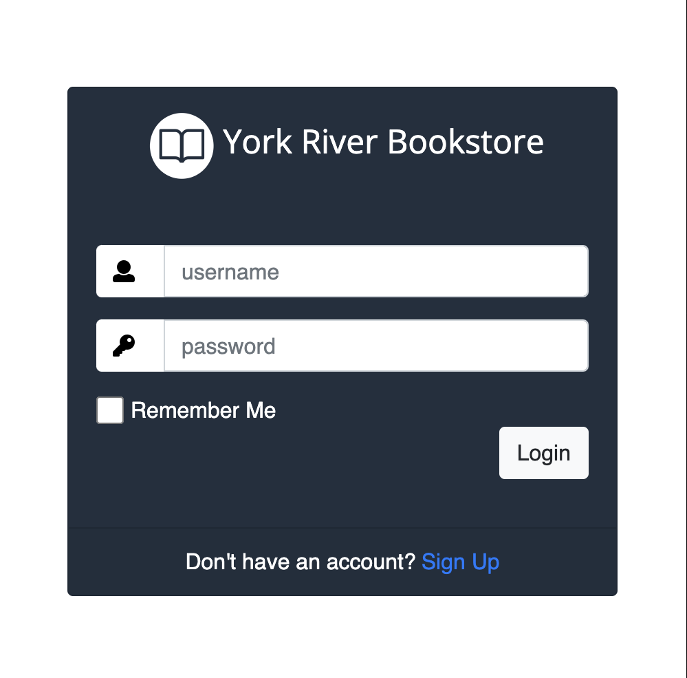
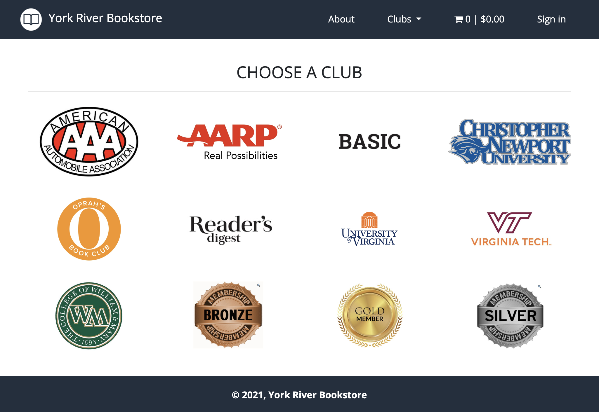
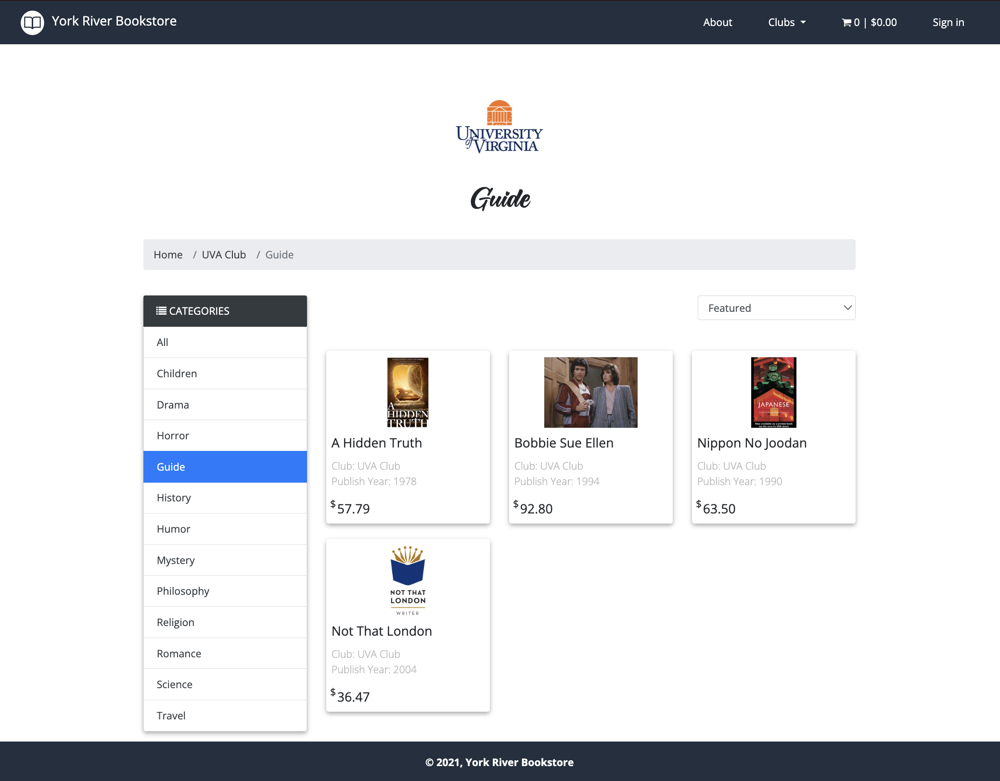
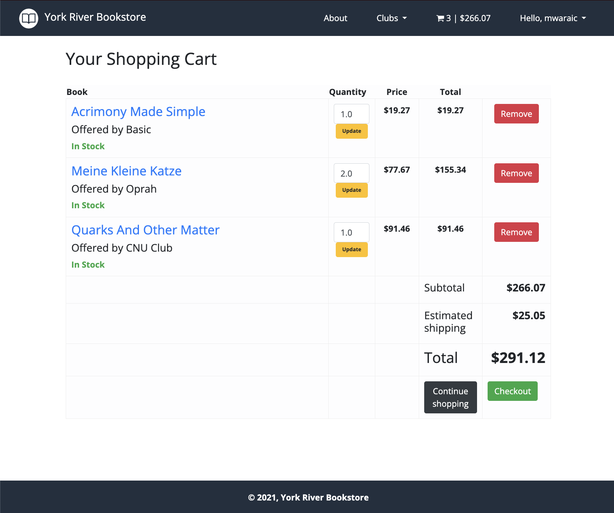
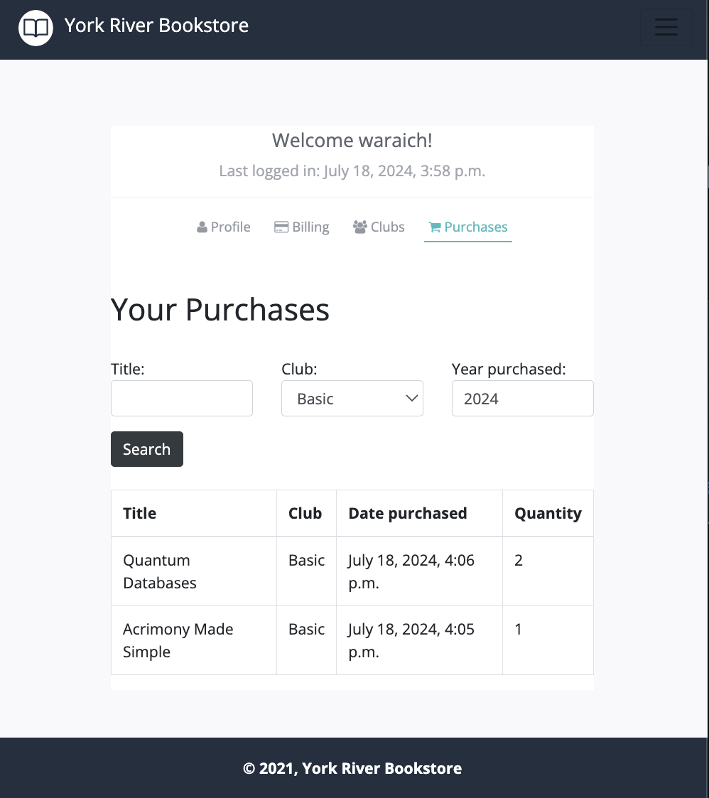

# York River Bookstore

This is a web application built using Django, designed to provide users with a convenient platform to purchase books related to their favorite clubs at the best offers. Whether you're a fan of sports, literature, or any other interest group, York River Bookstore aims to cater to your reading needs with a wide selection of books.

## Features

### User Authentication

- **User Registration:** Users can create an account on the platform by providing necessary details.
- **User Login:** Registered users can log in securely to access their account and make purchases.



### Club Selection

- **Browse Clubs:** Users can browse through a list of available clubs covering various interests.



### Book Catalog

- **Search and Filter:** Users can search for books by title, author, genre, or club affiliation.
- **Book Details:** Detailed information about each book, including title, author, synopsis, and price.



### Shopping Cart

- **Add to Cart:** Users can add books to their shopping cart for easy checkout.
- **Modify Quantity:** Users can adjust the quantity of books in their cart before proceeding to checkout.
- **Remove from Cart:** Users can remove items from their cart if they change their mind.



### User Profile

- **View Order History:** Users can view their past orders and track their order status.
- **Update Profile:** Users can update their personal information, including shipping address and contact details.



## Technologies Used

- **Django:** Python web framework for backend development.
- **HTML/CSS:** Frontend markup and styling.
- **JavaScript:** Frontend interactivity and dynamic content.
- **Postgresql:** Database management system for storing application data.
- **Bootstrap:** Frontend framework for responsive design and layout.

## Running Instructions

To start the project, follow these steps:

1. Open a terminal.
2. Navigate to the root directory of the project.
3. Run the following command:

   ```bash
   make start
   ```

   This command will bring up the Docker containers, run migrations, clean and populate tables, and then start the services.

## Accessing the Application

Once the project is running, you can access it by opening a web browser and navigating to the following address: http://localhost:8000
